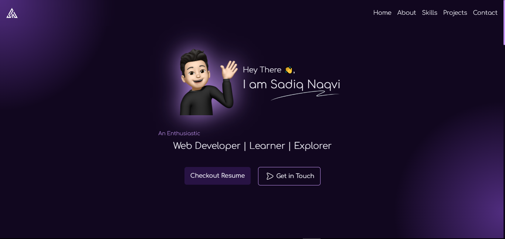

# Portfolio - Sadiq Naqvi

## Introduction

Portfolio webpage to introduce myself, to showcase my skills as well as my projects and to provide relevant links to contact me.

## Getting Started

To get started with my Portfolio, follow these steps:

1. Clone this repository to your local machine.
2. Navigate to the project directory.
3. Access the application in your web browser.

## Feedback

I value your feedback! If you have any suggestions, feature requests, or bug reports, please feel free to open an issue on GitHub or reach out to us directly.

## Contact

For any inquiries or support, please contact me at [naqvisadiq6@gmail.com](mailto:naqvisadiq6@gmail.com).
